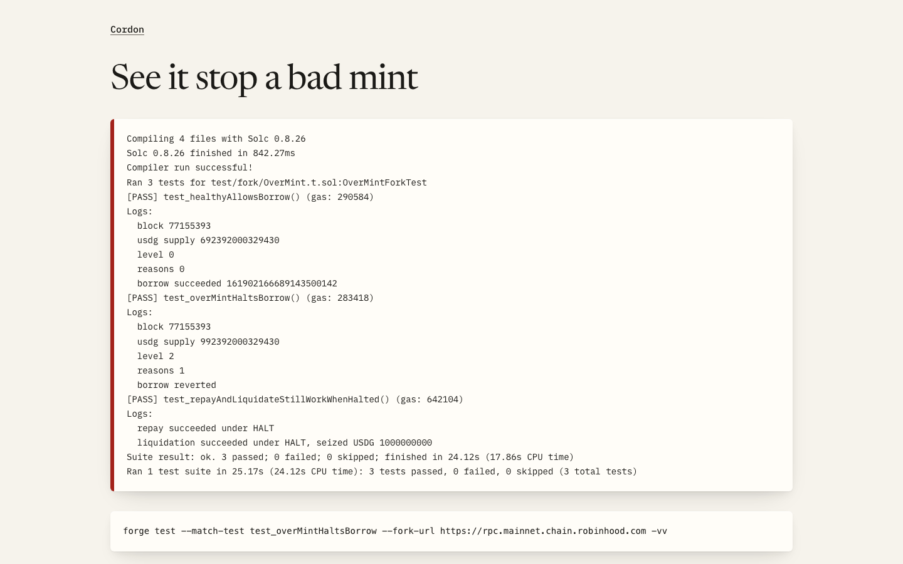
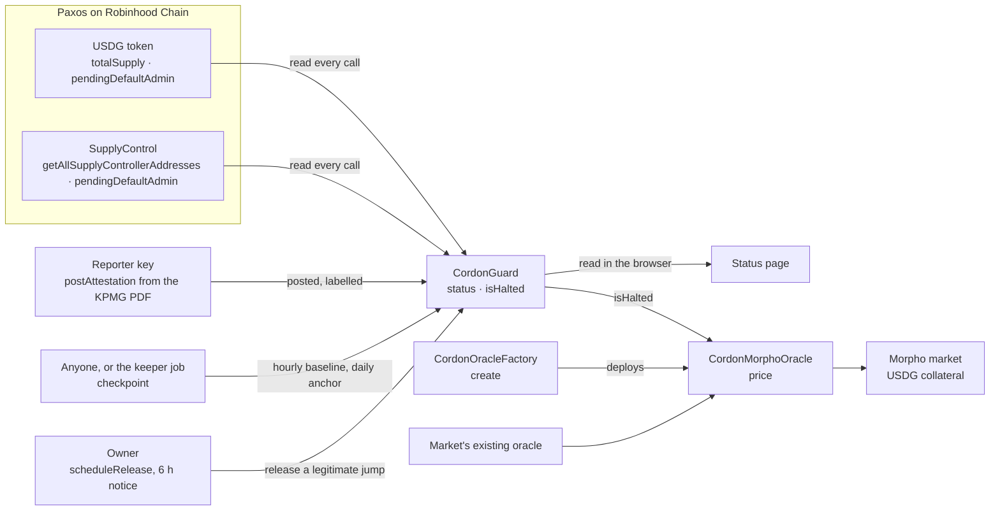

<div align="center">

# Cordon

[](https://github.com/Yonkoo11/cordon/actions/workflows/tests.yml)


[](https://yonkoo11.github.io/cordon/)

### Cordon tells lending markets when to stop accepting USDG.

**A circuit breaker for Paxos USDG on Robinhood Chain. A lending market asks it, inside the same transaction, whether Paxos' mint controls and attested backing still look right; if they don't, USDG collateral is valued lower. On a mainnet fork, a 300M USDG over-mint made through Paxos' real minter is caught in the same block and the borrow against it reverts. No key we hold can cause a HALT.**

**[ Status page ↗ ](https://yonkoo11.github.io/cordon/)** · **[ Guard a market ↗ ](https://yonkoo11.github.io/cordon/use.html)** · **[ See it stop a bad mint ↗ ](https://yonkoo11.github.io/cordon/replay.html)** · **[ Verify it yourself ↗ ](#verify-it-yourself-in-90-seconds)** · **[ Integration guide ↗ ](INTEGRATING.md)**

Built for the Arbitrum Open House Singapore Buildathon (Overall and Promising Products; Robinhood Chain and Paxos USDG).

</div>

---

## Screens

| The status page, reading Robinhood Chain mainnet in the browser | The first version of the page with only the guard's `status()` answer replaced by HALT, to show that state (simulated) | The fork test output, published as is |
|---|---|---|
|  |  |  |

---

## Table of contents
- [The problem](#the-problem)
- [What Cordon is](#what-cordon-is)
- [Verify it yourself in 90 seconds](#verify-it-yourself-in-90-seconds)
- [The headline result](#the-headline-result)
- [Architecture](#architecture)
- [Why these thresholds](#why-these-thresholds)
- [What's real, and what we deliberately did not claim](#whats-real-and-what-we-deliberately-did-not-claim)
- [Deployments](#deployments)
- [Project layout](#project-layout)
- [Run it locally](#run-it-locally)

## The problem

- **Issuers make mint errors.** On 15 October 2025 Paxos minted $300 trillion of PYUSD by mistake and burned it about 20 minutes later. Aave froze its PYUSD markets by hand.
- **USDG has no onchain backing signal.** Chainlink publishes a USDG/USD price feed on Robinhood Chain and no reserve feed for USDG or any Paxos coin (Chainlink reference directory, checked 2026-10-01).
- **The attested figure is old by the time it exists.** Paxos' KPMG report for 31 August 2026 was published on 25 September 2026.
- **The markets exist before the money does.** About 685M USDG sits on Robinhood Chain. Eight of its Morpho markets lend NVDA, SPY, AAPL, GOOGL, TSLA and VMAG against USDG collateral; on 2026-10-01 they held no borrows (one had 18.9 VMAG supplied). A market's oracle is fixed when it is created, so the time to put a guard in it is before lenders arrive.

## What Cordon is

One guard per token per chain, and adapters that act on it. The loop:

<div align="center">

**`READ PAXOS' CONTRACTS → CHECK → HEALTHY / CAUTION / HALT → MARKET DISCOUNTS USDG ON HALT`**

</div>

1. **Read.** `CordonGuard.status()` reads the USDG token (`totalSupply`, `pendingDefaultAdmin`) and Paxos' SupplyControl (`getAllSupplyControllerAddresses`, `pendingDefaultAdmin`) in the same call.
2. **Check.** Supply against a baseline taken 30 minutes to 2 hours earlier; the minter set against the recorded one; pending admin transfers; the latest KPMG figures posted with the report's SHA-256.
3. **Decide.** HALT only when supply read from the chain rises more than 25% above the hourly baseline (30 min to 2 h old) or the daily anchor (moved at most once a day). Everything else, including every figure our reporter posts, is CAUTION, which never touches price. So no key we hold can cause a HALT.
4. **Latch and release.** A HALT stays latched until the excess is burned. If the jump was legitimate (a large bridge-in), the owner can release it only after six hours of public notice, and only if supply has not grown since.
5. **Act.** `CordonOracleFactory.create(oracle, discount)` wraps a market's existing oracle. The wrapper discounts USDG collateral on HALT by a share the market creator sets, and never reverts, so repaying and liquidating keep working. [`use.html`](https://yonkoo11.github.io/cordon/use.html) does it from a browser wallet.

## Verify it yourself in 90 seconds

No key, no wallet, no RPC account. Every line below was run on a fresh clone from GitHub on 2026-10-01; the results are in the comments.

```bash
git clone --recurse-submodules https://github.com/Yonkoo11/cordon && cd cordon
forge test --no-match-path "test/fork/*"
# → 46 tests passed, 0 failed, 0 skipped (46 total tests)
forge test --match-path test/fork/OverMint.t.sol --fork-url https://rpc.mainnet.chain.robinhood.com -vv
# → [PASS] test_healthyAllowsBorrow()  level 0  reasons 0  borrow succeeded
# → [PASS] test_overMintHaltsBorrow()  level 2  reasons 1  borrow reverted
# → [PASS] test_repayAndLiquidateStillWorkWhenHalted()  repay succeeded under HALT; liquidation seized 1000000000 (1,000 USDG)
# → [PASS] test_bridgeInReleasedAfterNotice()  bridge-in of 200M latched HALT; after 6 h notice and release, level 0; borrow succeeded
cast call 0x1F82E5aB72B6Ec93e852533Ed9D021CbF51969AC "status()(uint8,uint256)" --rpc-url https://rpc.mainnet.chain.robinhood.com
# → two numbers: level (0 healthy, 1 caution, 2 halt) and the reason bits (see INTEGRATING.md).
```

If Foundry reports `BadRecordMac` from the public RPC, rerun the command; that is a TLS error between some clients and the endpoint, not a test failure.

The fork test runs against Robinhood Chain mainnet state at the latest block: the real USDG contract, Paxos' real minter `0x2fb0…41a4` and LayerZero wrapper `0x0d54…28d1` (impersonated on the fork), the real Morpho deployment and the real NVDA price oracle. The bridge-in test holds the NVDA price at its pre-skip value while it skips six hours, because the live feed reports stale otherwise. It proves the guard and the adapter behave as stated against live contracts. It does not prove a curator will use them.

## The headline result

```
[PASS] test_overMintHaltsBorrow() (gas: 278498)
Logs:
  block 77358393
  usdg supply 985558411663483
  level 2
  reasons 1
  borrow reverted
```

Supply went from 685.56M to 985.56M USDG (+44%) through one call to Paxos' minter, inside that minter's real 1B rate limit. In the same block the guard reported HALT with reason bit 0, and a borrow that succeeds on a healthy day was refused.

## Architecture



`src/CordonGuard.sol` holds every check; `src/CordonMorphoOracle.sol` is the only part a market touches, made by `src/CordonOracleFactory.sol`; `web/chain.js` and `web/use.js` read the chain from the visitor's browser.

## Why these thresholds

| Parameter | Value | Where it came from |
|---|---|---|
| HALT jump | +25% against the hourly baseline (30 min to 2 h old) or the daily anchor | 12,414 mint and 9,047 burn events decoded from chain launch; once supply passed 300M the largest rise was +11.9% in an hour, +13.2% in a day and +20.4% in two days |
| CAUTION jump | +15% | between the largest observed rise and HALT |
| Baseline window | 30 min to 2 h | one window holds every observed legitimate rise; older baselines read as "no baseline" (CAUTION), never HALT |
| Daily anchor | moves at most once per day; ignored after 2 days | stops a walk of many sub-25% mints, each checkpointed (found in review; `test_slowOverMintHaltsOnAnchor`) |
| Release notice | 6 h, and supply must not grow during it | longer than the 2 h baseline window, so the pre-jump baseline has expired before a release can run |
| Stale report | 62 days after period end | Paxos publishes monthly (the August report came 25 days after period end) |
| Mint capacity on this chain | 500M + 1B + 200M + 10 USDG | `getSupplyControllerConfig` on Paxos' SupplyControl, read 2026-10-01 |

## What's real, and what we deliberately did not claim

| Capability | Status |
|---|---|
| **Same-block HALT on an over-mint** | Real. Mainnet-fork test, 4 of 4 passing, output in `demo/replay.txt`. |
| **Repay and liquidation keep working under HALT** | Real. Same fork test. |
| **No key we hold can cause a HALT** | Real in code and tested: only a supply jump read from the chain reaches HALT; a 2,000-run fuzz test drives the reporter and owner and never sees HALT. |
| **Release of a legitimate jump** | Real. Fork test: a 200M bridge-in through Paxos' LayerZero wrapper halts, is released after 6 h, and borrowing works again. |
| **Deployed on Robinhood Chain mainnet** | Real. Guard, factory, a factory-made wrapper and a Morpho market, verified on Sourcify. See [Deployments](#deployments). |
| **Self-serve adoption** | Built and tested on a local mainnet fork with a test wallet (wrapper and market created, then read back from the fork). No outside curator has used it yet. |
| **KPMG figures on chain** | Posted, not proven. Our reporter key posted the 31 August 2026 figures with the PDF's SHA-256 (0x3847…e37e). They can raise CAUTION, never HALT. |
| **Automatic baselines** | A GitHub Actions job every 10 minutes, plus a backup on one machine. Anyone can call `checkpoint()`. If all stop, the guard shows CAUTION. |
| Griefing by bridging | Possible, stated. Bridging about 25% of the chain's supply out and back in trips HALT; what that costs borrowers depends on the discount ([INTEGRATING.md](INTEGRATING.md#known-trade-offs)). |
| Money in USDG-collateral markets today | None borrowed on 2026-10-01. Cordon is in place before it arrives. |
| Proof of Paxos' reserves | Not claimed. Cordon cannot see a bank account. |
| Other chains (Ethereum, Solana, X Layer, Ink, Mantle) | Not checked. Supply minted elsewhere is invisible to this guard. |
| Contract upgrades | Not detected. USDG exposes no onchain getter for its implementation. |
| Owner key | One key today. `transferOwnership` / `acceptOwnership` exist to move it to a Safe. |
| Audit | Not audited. An adversarial review found a slow over-mint gap and a checkpoint-gap gap, both fixed with tests; Slither reports no High or Medium findings. That is not an audit. |

## Deployments

| Chain | Contract | Address |
|---|---|---|
| Robinhood Chain (4663) | CordonGuard | [`0x1F82E5aB72B6Ec93e852533Ed9D021CbF51969AC`](https://robinhoodchain.blockscout.com/address/0x1F82E5aB72B6Ec93e852533Ed9D021CbF51969AC) |
| Robinhood Chain (4663) | CordonOracleFactory | [`0xA0A564D5C2D8c8E01191Cb70E39322E85B1045EF`](https://robinhoodchain.blockscout.com/address/0xA0A564D5C2D8c8E01191Cb70E39322E85B1045EF) |
| Robinhood Chain (4663) | CordonMorphoOracle (via the factory) | [`0x4FAFD0C44fB2757703F9e3F7B28564666Edfd860`](https://robinhoodchain.blockscout.com/address/0x4FAFD0C44fB2757703F9e3F7B28564666Edfd860) |
| Robinhood Chain (4663) | Morpho market (USDG collateral, NVDA loan, LLTV 62.5%) | id `0xb2f1e172da1fc454a25f9405b0d145cccd603fe56c719d0d5f4ddaf5017b91dc` |
| Arbitrum Sepolia (421614) | CordonGuard (Paxos test USDG) | [`0xfEbB84BE47b0d440Ba08DaE0f5E3b09B4f989Cf8`](https://sepolia.arbiscan.io/address/0xfEbB84BE47b0d440Ba08DaE0f5E3b09B4f989Cf8) |
| Arbitrum Sepolia (421614) | CordonOracleFactory | [`0x59a69BAFb6dCc9BF304bBE0583561aDf3B613435`](https://sepolia.arbiscan.io/address/0x59a69BAFb6dCc9BF304bBE0583561aDf3B613435) |

Transactions, blocks and the superseded first version: [`DEPLOYMENTS.md`](DEPLOYMENTS.md).

## Tech stack
- **Contracts:** Solidity 0.8.26, Foundry. **Tests:** 46 unit (including two 2,000-run fuzz tests) in CI, plus 4 mainnet-fork tests.
- **Site:** static pages, no framework, reading the chain over JSON-RPC from the browser; `use.html` writes through the visitor's own wallet.
- **Chain:** Robinhood Chain mainnet; Arbitrum Sepolia.

## Project layout
```
src/
  CordonGuard.sol          # every check, the reason bits, the halt latch, the timelocked release
  CordonMorphoOracle.sol   # Morpho IOracle wrapper: discounts on HALT, never reverts
  CordonOracleFactory.sol  # deploys wrappers at predictable addresses
  interfaces/IPaxos.sol    # the parts of Paxos' USDG and SupplyControl Cordon reads
test/
  unit/                    # 46 tests against mocks, including two fuzz tests
  fork/OverMint.t.sol      # Robinhood Chain mainnet fork: healthy, over-mint, repay and liquidate, bridge-in release
script/                    # Deploy, DeployMarket, Checkpoint (key from env DEPLOYER_PRIVATE_KEY)
attestations/2026-08.json  # the KPMG figures posted on chain, with the PDF's SHA-256
web/                       # status page, guard-a-market page, replay page (GitHub Pages)
demo/replay.txt            # the fork test output shown on the replay page
.github/workflows/         # tests, Pages deploy, and the checkpoint keeper (every 10 min)
INTEGRATING.md             # for curators: discount maths, reason bits, keys, trade-offs
```

## Run it locally
```bash
forge build                                   # compile
forge test --no-match-path "test/fork/*"      # unit tests
cd web && python3 -m http.server 8000         # status page at http://localhost:8000
```

MIT licence. Not affiliated with Paxos or Robinhood.
