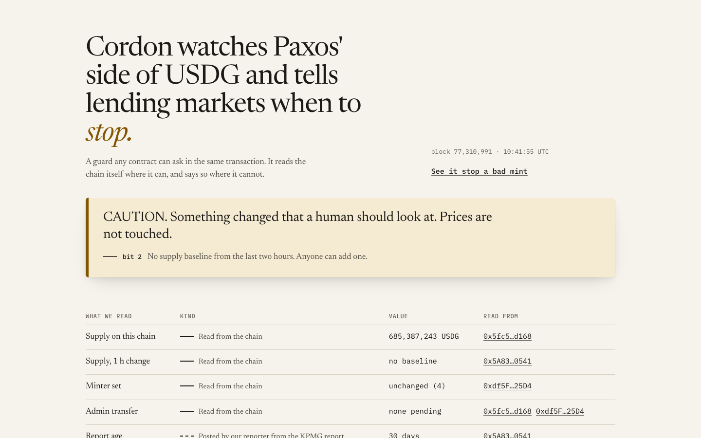
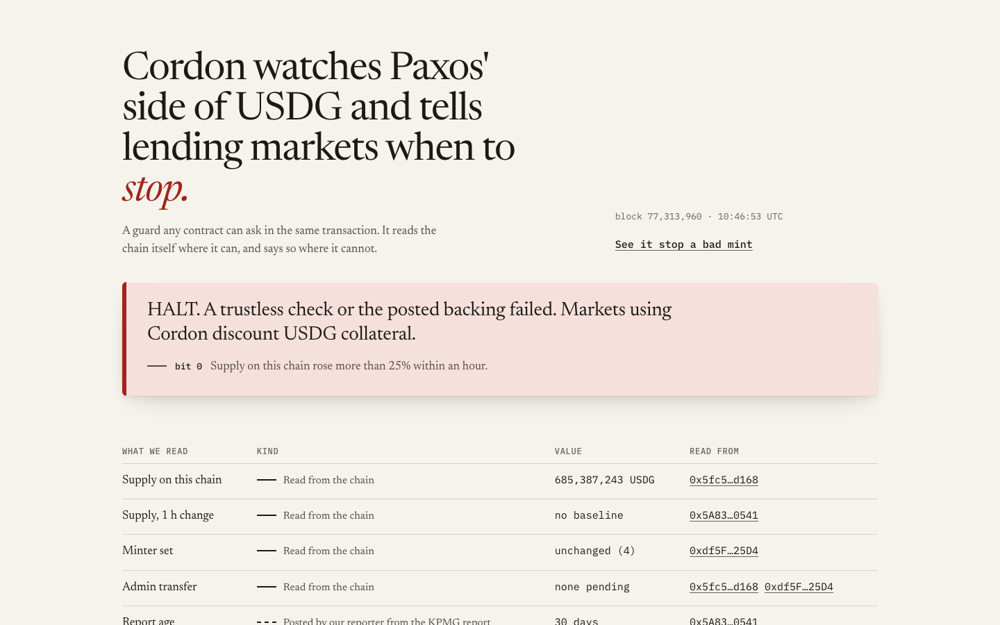
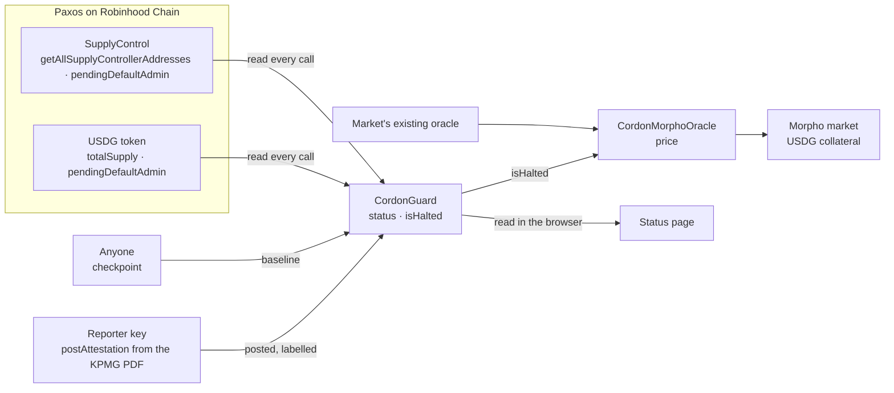

<div align="center">

# Cordon

[](https://github.com/Yonkoo11/cordon/actions/workflows/tests.yml)


[](https://yonkoo11.github.io/cordon/)

### Cordon tells lending markets when to stop accepting USDG.

**A circuit breaker for Paxos USDG on Robinhood Chain. A lending market asks it, inside the same transaction, whether Paxos' mint controls and attested backing still look right; if they don't, USDG collateral is valued lower. On a mainnet fork, a 300M USDG over-mint made through Paxos' real minter is caught in the same block and the borrow against it reverts.**

**[ Status page ↗ ](https://yonkoo11.github.io/cordon/)** · **[ See it stop a bad mint ↗ ](https://yonkoo11.github.io/cordon/replay.html)** · **[ Verify it yourself ↗ ](#verify-it-yourself-in-90-seconds)** · **[ The guard on Sourcify ↗ ](https://repo.sourcify.dev/4663/0x5A832cb202aeBa13E50CFc03FF3D4C51462d0541)**

Built for the Arbitrum Open House Singapore Buildathon (Overall and Promising Products; Robinhood Chain and Paxos USDG).

</div>

---

## Screens

| The live page, reading Robinhood Chain mainnet in the browser (CAUTION: no baseline in the last two hours) | The same page with only the guard's `status()` answer replaced by HALT, to show that state (simulated) | The fork test output, published as is |
|---|---|---|
|  |  |  |

---

## Table of contents
- [The problem](#the-problem)
- [What Cordon is](#what-cordon-is)
- [Verify it yourself in 90 seconds](#verify-it-yourself-in-90-seconds)
- [The headline result](#the-headline-result)
- [Architecture](#architecture)
- [Why these thresholds](#why-these-thresholds)
- [What's real, and what we deliberately did not claim](#whats-real-and-what-we-deliberately-did-not-claim)
- [Deployments](#deployments)
- [Project layout](#project-layout)
- [Run it locally](#run-it-locally)

## The problem

- **Issuers make mint errors.** On 15 October 2025 Paxos minted $300 trillion of PYUSD by mistake and burned it about 20 minutes later. Aave froze its PYUSD markets by hand.
- **USDG has no onchain backing signal.** Chainlink publishes a USDG/USD price feed on Robinhood Chain and no reserve feed for USDG or any Paxos coin (Chainlink reference directory, checked 2026-10-01).
- **The attested figure is old by the time it exists.** Paxos' KPMG report for 31 August 2026 was published on 25 September 2026.
- **Real collateral is exposed.** About 685M USDG sits on Robinhood Chain, and 8 of its 299 Morpho markets lend NVDA, SPY, AAPL, GOOGL, TSLA and VMAG against USDG collateral.

## What Cordon is

One guard per token per chain, and adapters that act on it. The loop:

<div align="center">

**`READ PAXOS' CONTRACTS → CHECK → HEALTHY / CAUTION / HALT → MARKET DISCOUNTS USDG ON HALT`**

</div>

1. **Read.** `CordonGuard.status()` reads the USDG token (`totalSupply`, `pendingDefaultAdmin`) and Paxos' SupplyControl (`getAllSupplyControllerAddresses`, `pendingDefaultAdmin`) in the same call.
2. **Check.** Supply against a baseline taken 30 minutes to 2 hours earlier; the minter set against the recorded one; pending admin transfers; the latest KPMG figures posted with the report's SHA-256.
3. **Decide.** HALT only on a supply jump over 25%, posted reserves below posted outstanding, or chain supply above the posted all-chain total. Everything else is CAUTION, which never touches price. A HALT-level jump stays latched until the excess is burned.
4. **Act.** `CordonMorphoOracle` wraps a market's existing oracle and discounts USDG collateral on HALT by a share the market creator sets. It never reverts, so repaying and liquidating keep working.

## Verify it yourself in 90 seconds

No key, no wallet, no RPC account. Every line below was run on a fresh clone on 2026-10-01; the results are in the comments.

```bash
git clone --recurse-submodules https://github.com/Yonkoo11/cordon && cd cordon
forge test --no-match-path "test/fork/*"
# → 28 tests passed, 0 failed, 0 skipped (28 total tests)
forge test --match-path test/fork/OverMint.t.sol --fork-url https://rpc.mainnet.chain.robinhood.com -vv
# → [PASS] test_healthyAllowsBorrow()  level 0  reasons 0  borrow succeeded
# → [PASS] test_overMintHaltsBorrow()  level 2  reasons 1  borrow reverted
# → [PASS] test_repayAndLiquidateStillWorkWhenHalted()  repay succeeded under HALT; liquidation seized 1000000000 (1,000 USDG)
cast call 0x5A832cb202aeBa13E50CFc03FF3D4C51462d0541 "status()(uint8,uint256)" --rpc-url https://rpc.mainnet.chain.robinhood.com
# → two numbers: level (0 healthy, 1 caution, 2 halt) and the reason bits. On 2026-10-01 at 10:41 UTC it read 1 and 4 (no baseline).
```

The fork test runs against Robinhood Chain mainnet state at the latest block: the real USDG contract, Paxos' real minter `0x2fb0…41a4` (impersonated on the fork), the real Morpho deployment and the real NVDA price oracle. It proves the guard and the adapter behave as stated against live contracts. It does not prove a curator will use them.

## The headline result

```
[PASS] test_overMintHaltsBorrow() (gas: 283418)
Logs:
  block 77155393
  usdg supply 992392000329430
  level 2
  reasons 1
  borrow reverted
```

Supply went from 692.39M to 992.39M USDG (+43%) through one call to Paxos' minter, inside that minter's real 1B rate limit. In the same block the guard reported HALT with reason bit 0, and a borrow that succeeds on a healthy day was refused.

## Architecture



`src/CordonGuard.sol` holds every check; `src/CordonMorphoOracle.sol` is the only part a market touches; `web/chain.js` reads both from the visitor's browser.

## Why these thresholds

| Parameter | Value | Where it came from |
|---|---|---|
| HALT jump | +25% within 30 min to 2 h | 12,414 mint and 9,047 burn events decoded from chain launch; once supply passed 300M the largest rise was +11.9% in an hour and +12.3% in a day |
| CAUTION jump | +15% | between the largest observed rise and HALT |
| Baseline window | 30 min to 2 h | one window holds every observed legitimate rise; older baselines read as "no baseline" (CAUTION), never HALT |
| Stale report | 62 days after period end | Paxos publishes monthly (the August report came 25 days after period end) |
| Mint capacity on this chain | 500M + 1B + 200M + 10 USDG | `getSupplyControllerConfig` on Paxos' SupplyControl, read 2026-10-01 |

## What's real, and what we deliberately did not claim

| Capability | Status |
|---|---|
| **Same-block HALT on an over-mint** | Real. Mainnet-fork test, 3 of 3 passing, output in `demo/replay.txt`. |
| **Repay and liquidation keep working under HALT** | Real. Same fork test. |
| **Deployed on Robinhood Chain mainnet** | Real. Guard, adapter and a Morpho market, verified on Sourcify. See [Deployments](#deployments). |
| **KPMG figures on chain** | Posted, not proven. Our reporter key posted the 31 August 2026 figures with the PDF's SHA-256 (0x3847…e37e). The page labels them as posted. |
| Proof of Paxos' reserves | Not claimed. Cordon cannot see a bank account. |
| Other chains (Ethereum, Solana, X Layer, Ink, Mantle) | Not checked. Supply minted elsewhere is invisible to this guard. |
| Contract upgrades | Not detected. USDG exposes no onchain getter for its implementation. |
| Automatic baselines | Not running yet. Anyone can call `checkpoint()`; until something does every half hour, the guard drifts to CAUTION. |
| Adoption | None yet. Existing Morpho markets fix their oracle at creation, so only new markets can use the adapter. |
| Protection for people who simply hold USDG | Not claimed. They hold USDG either way. |
| Audit | Not audited. Slither reports no High or Medium findings; that is not an audit. |

## Deployments

| Chain | Contract | Address |
|---|---|---|
| Robinhood Chain (4663) | CordonGuard | [`0x5A832cb202aeBa13E50CFc03FF3D4C51462d0541`](https://robinhoodchain.blockscout.com/address/0x5A832cb202aeBa13E50CFc03FF3D4C51462d0541) |
| Robinhood Chain (4663) | CordonMorphoOracle | [`0x52FB7D121e576D8B0b06dD6fcA6C3D7454e7bf5C`](https://robinhoodchain.blockscout.com/address/0x52FB7D121e576D8B0b06dD6fcA6C3D7454e7bf5C) |
| Robinhood Chain (4663) | Morpho market (USDG collateral, NVDA loan, LLTV 62.5%) | id `0x3a8f9ccf25583b6216f553d5d8b1a2c981818b2df61febf48d60080e6850c4cc` |
| Arbitrum Sepolia (421614) | CordonGuard (Paxos test USDG) | [`0x2522423855550e82016103c79F097042Cf2d5a0B`](https://sepolia.arbiscan.io/address/0x2522423855550e82016103c79F097042Cf2d5a0B) |

Transactions and blocks: [`DEPLOYMENTS.md`](DEPLOYMENTS.md).

## Tech stack
- **Contracts:** Solidity 0.8.26, Foundry. **Tests:** 28 unit (including a 2,000-run fuzz test) in CI, plus 3 mainnet-fork tests.
- **Site:** one static page, no framework, no wallet, reading the chain over JSON-RPC from the browser.
- **Chain:** Robinhood Chain mainnet; Arbitrum Sepolia.

## Project layout
```
src/
  CordonGuard.sol          # every check, the reason bits, the halt latch
  CordonMorphoOracle.sol   # Morpho IOracle wrapper: discounts on HALT, never reverts
  interfaces/IPaxos.sol    # the parts of Paxos' USDG and SupplyControl Cordon reads
test/
  unit/                    # 28 tests against mocks, including a fuzz test
  fork/OverMint.t.sol      # Robinhood Chain mainnet fork: healthy, over-mint, repay and liquidate
script/                    # Deploy, DeployMarket, Checkpoint (key from env DEPLOYER_PRIVATE_KEY)
attestations/2026-08.json  # the KPMG figures posted on chain, with the PDF's SHA-256
web/                       # the status page (GitHub Pages)
demo/replay.txt            # the fork test output shown on the replay page
```

## Run it locally
```bash
forge build                                   # compile
forge test --no-match-path "test/fork/*"      # unit tests
cd web && python3 -m http.server 8000         # status page at http://localhost:8000
```

MIT licence. Not affiliated with Paxos or Robinhood.
